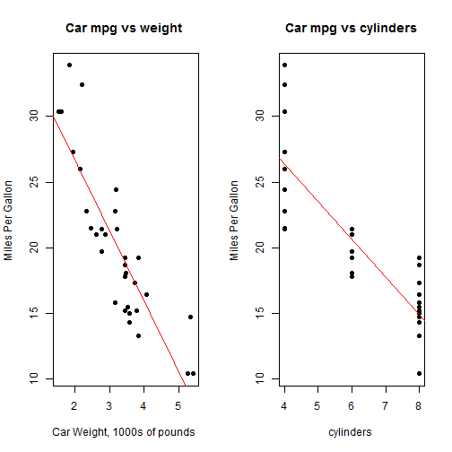
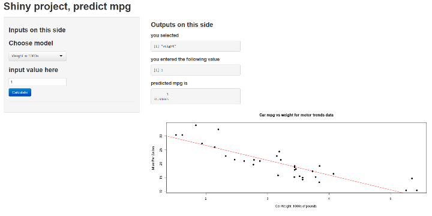

## mpg prediction application using Shiny

### decided on using motor trends car data
Do some exploratory analysis


```r
data(mtcars)
head(mtcars)
```

```
##                    mpg cyl disp  hp drat    wt  qsec vs am gear carb
## Mazda RX4         21.0   6  160 110 3.90 2.620 16.46  0  1    4    4
## Mazda RX4 Wag     21.0   6  160 110 3.90 2.875 17.02  0  1    4    4
## Datsun 710        22.8   4  108  93 3.85 2.320 18.61  1  1    4    1
## Hornet 4 Drive    21.4   6  258 110 3.08 3.215 19.44  1  0    3    1
## Hornet Sportabout 18.7   8  360 175 3.15 3.440 17.02  0  0    3    2
## Valiant           18.1   6  225 105 2.76 3.460 20.22  1  0    3    1
```

--- .class #id

## linear regresssion 

### predicted mpg based on weight (wt) and cylinders (cyl)


 

--- .class #id

## create ui.R and server.R
The ui is created within the shinyUI function. I used the pageWithSidebar.

```r
shinyUI(pageWithSidebar(
    headerPanel("Shiny project, predict mpg"),
    sidebarPanel(),
    mainPanel(   )
    ))
```
The server code is a function with input and output inside a shinyServer function

```r
shinyServer(
    function(input, output){
    }
)
```

--- .class #id

## final output
### after ui.r and server.r are complete, shinyapps.deployApp('file')

 
